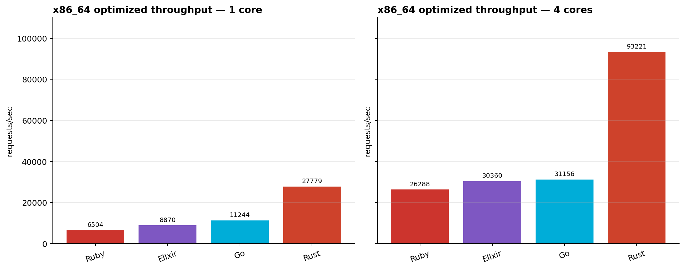
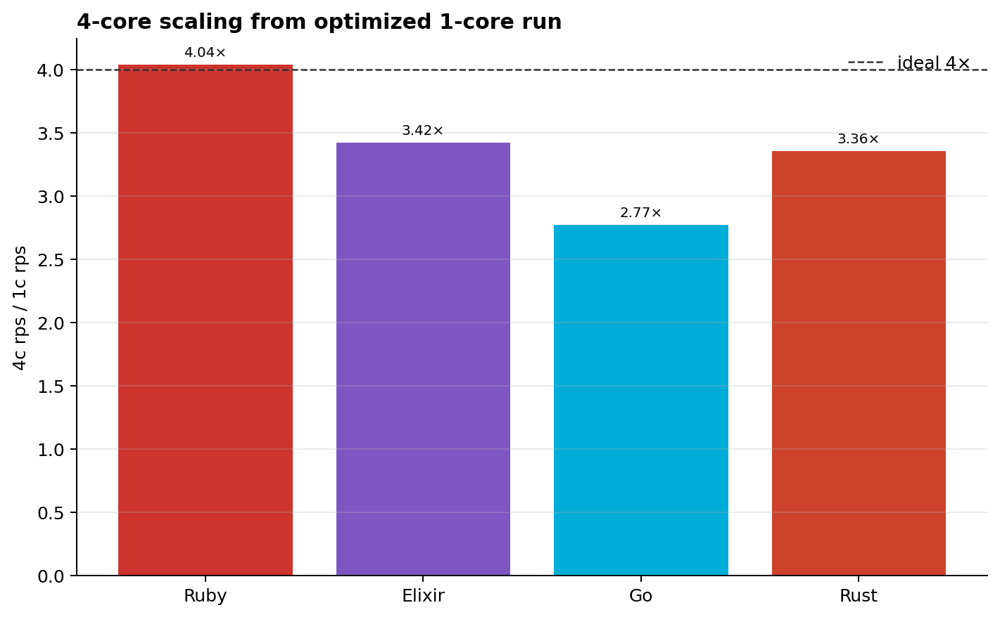
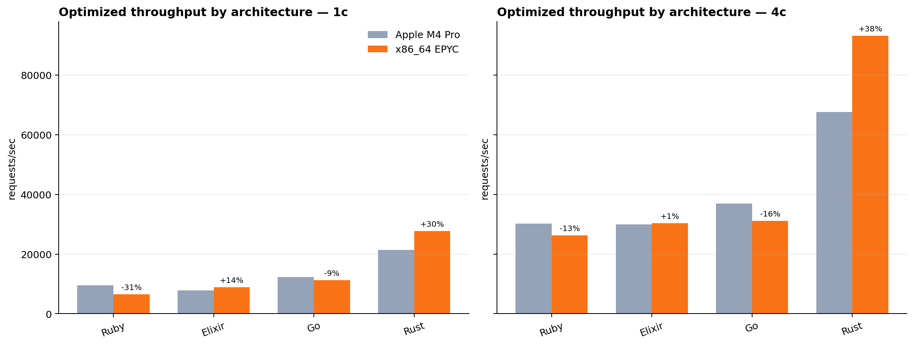
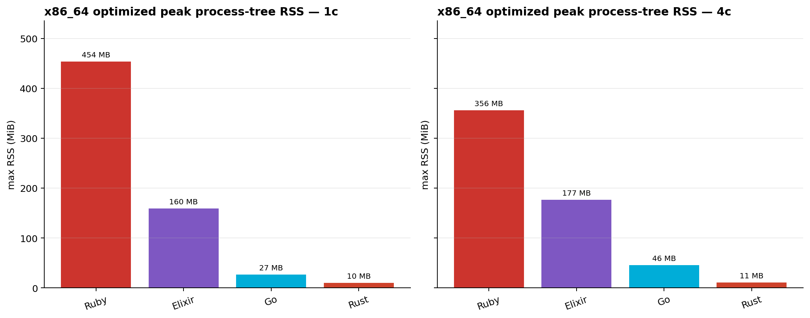
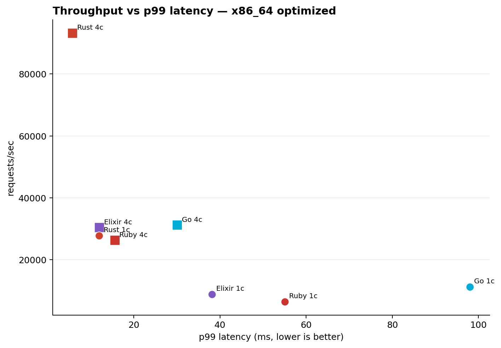

# Webhook Processing Benchmark — x86_64 Linux Results

Host: AMD EPYC 4484PX 12-Core Processor (12 physical cores / 24 logical CPUs), AuthenticAMD, 93Gi RAM, Debian GNU/Linux 12 (bookworm), kernel 6.1.0-43-amd64
Frequency: min 3000.0000 MHz, max 5660.2700 MHz as reported by `lscpu`.
Workload: Shopify-style `POST /webhook` — HMAC-SHA256 verify → JSON parse → for each variant, upcase string values + serialize back to JSON + write to `/dev/null`. Single ~10KB payload with 5 variants.
Client: Rust + tokio + hyper raw HTTP/1.1, 256 keep-alive connections, 5s warmup, 30s measurement window.

Note: the prompt called this an Intel run, but the machine reports `AuthenticAMD` / AMD EPYC. Treat these as x86_64 Linux results rather than Intel-branded silicon results.

## Hardware report

| Item | Value |
|------|-------|
| CPU model | AMD EPYC 4484PX 12-Core Processor |
| CPU vendor | AuthenticAMD |
| Physical cores | 12 |
| Logical CPUs | 24 |
| Frequency | 3000.0000–5660.2700 MHz reported by `lscpu` |
| RAM | 93Gi |
| OS/kernel | Debian GNU/Linux 12 (bookworm), kernel 6.1.0-43-amd64 |

Toolchains:
- `rustc 1.94.1 (e408947bf 2026-03-25) (built from a source tarball)`
- `go version go1.26.2 linux/amd64`
- `Elixir 1.20.0-rc.5 (compiled with Erlang/OTP 29)` / `Erlang/OTP 29.0`
- `ruby 3.4.9 (2026-03-11 revision 76cca827ab) +YJIT +PRISM [x86_64-linux]`
- `uv 0.11.11 (x86_64-unknown-linux-gnu)`
- `OpenSSL 3.6.1 27 Jan 2026 (Library: OpenSSL 3.6.1 27 Jan 2026)`

CPU caps are enforced natively per language (no containers): `GOMAXPROCS`, `TOKIO_WORKER_THREADS`, BEAM `+S N:N` (plus dirty / async pool caps), `falcon --count N`. The harness also samples process-tree RSS for the server PID and descendants; RSS can double-count shared pages across multi-process servers, so treat it as process-tree resident memory rather than unique physical memory. Validity checks are included below; Go, Rust, and Ruby passed all checks, while all Elixir runs exceeded the 10% CPU-cap slack on this Linux/OTP 29 host.

## Baselines

| Lang   | Cores | rps    | p50 (µs) | p99 (µs) | server CPU | max RSS | vs M4 Pro | validity |
|--------|-------|-------:|---------:|---------:|-----------:|--------:|----------:|----------|
| Ruby   | 1 | 5,522 | 48,735 | 66,495 | 99.9% | 1002.6 MiB | -29.3% | ok |
| Elixir | 1 | 7,758 | 32,799 | 49,119 | 127.4% | 162.1 MiB | +9.6% | CAP FAIL |
| Go     | 1 | 6,501 | 21,535 | 148,479 | 100.0% | 18.1 MiB | -15.7% | ok |
| Rust   | 1 | 25,814 | 9,799 | 13,719 | 99.9% | 9.2 MiB | +27.2% | ok |
| Ruby   | 4 | 22,592 | 11,607 | 16,799 | 399.9% | 319.2 MiB | -10.1% | ok |
| Elixir | 4 | 27,411 | 9,135 | 14,015 | 474.0% | 188.8 MiB | -1.8% | CAP FAIL |
| Go     | 4 | 19,068 | 11,079 | 49,087 | 392.1% | 29.0 MiB | -19.7% | ok |
| Rust   | 4 | 90,160 | 2,669 | 5,679 | 399.4% | 10.2 MiB | +42.8% | ok |

Stacks:
- Ruby — Falcon + Rack + stdlib `json`, Ruby 3.4.9 with YJIT available.
- Elixir — Bandit + Plug + Jason on OTP 29 / Elixir 1.20.0-rc.5.
- Go — `net/http` stdlib + `encoding/json`, Go 1.26.2.
- Rust — axum 0.7 + serde_json + tokio multi-thread, Rust 1.94.1.

## Optimization rounds

| Lang   | Cores | Variant | rps | Δ vs baseline | p50 (µs) | p99 (µs) | server CPU | max RSS | vs M4 Pro opt | validity |
|--------|-------|---------|----:|--------------:|---------:|---------:|-----------:|--------:|--------------:|----------|
| Ruby   | 1 | `oj` + YJIT | 6,504 | +17.8% | 39,583 | 55,039 | 99.9% | 453.7 MiB | -31.5% | ok |
| Ruby   | 4 | `oj` + YJIT | 26,288 | +16.4% | 9,791 | 15,583 | 399.9% | 356.4 MiB | -13.1% | ok |
| Elixir | 1 | OTP 29 `:json` | 8,870 | +14.3% | 28,767 | 38,111 | 127.7% | 159.7 MiB | +13.8% | CAP FAIL |
| Elixir | 4 | OTP 29 `:json` | 30,360 | +10.8% | 8,255 | 12,039 | 475.4% | 177.1 MiB | +1.2% | CAP FAIL |
| Go     | 1 | `goccy/go-json` + GOGC=200 | 11,244 | +73.0% | 18,639 | 97,983 | 100.3% | 26.8 MiB | -9.1% | ok |
| Go     | 4 | `goccy/go-json` + GOGC=200 | 31,156 | +63.4% | 6,799 | 30,079 | 393.2% | 45.7 MiB | -15.8% | ok |
| Rust   | 1 | `simd-json` + scratch buf | 27,779 | +7.6% | 9,079 | 11,951 | 99.8% | 10.0 MiB | +29.9% | ok |
| Rust   | 4 | `simd-json` + scratch buf | 93,221 | +3.4% | 2,611 | 5,771 | 399.4% | 11.2 MiB | +38.0% | ok |

Knobs:
- Ruby — enabled YJIT (`RUBY_YJIT_ENABLE=1`) and selected the `oj` JSON path (`WPB_JSON=oj`).
- Elixir — updated to Elixir 1.20.0-rc.5 compiled with OTP 29 and selected the OTP built-in `:json` module (`WPB_JSON=otp28`, retained as the env value name for the built-in backend).
- Go — replaced `encoding/json` with `goccy/go-json` and raised `GOGC` from 100 to 200.
- Rust — feature-gated `simd-json` for parsing and reused a scratch buffer for serialized output.

## Validity checks

The following runs failed at least one required validity check and should be treated as flagged rather than silently accepted:

| Result | rps | Reason |
|--------|----:|--------|
| `elixir-1c-elixir120rc5-otp29-jason` | 7,758 | cap_holds=false (127.4% avg vs 100% cap) |
| `elixir-1c-elixir120rc5-otp29-json` | 8,870 | cap_holds=false (127.7% avg vs 100% cap) |
| `elixir-4c-elixir120rc5-otp29-jason` | 27,411 | cap_holds=false (474.0% avg vs 400% cap) |
| `elixir-4c-elixir120rc5-otp29-json` | 30,360 | cap_holds=false (475.4% avg vs 400% cap) |

Investigation: the failing set is limited to Elixir. The harness launched BEAM with the intended scheduler cap flags (`+S N:N +SDcpu 1:1 +SDio 1 +A 1 +sbwt none +sbwtdcpu none +sbwtdio none`), errors stayed at zero, and the client was not bottlenecked. CPU sampling still measured ~127% at 1c and ~474–475% at 4c even after updating to OTP 29. This is materially worse drift than the M4 Pro note (~10–13%) and should be considered a platform/runtime cap limitation for these Elixir numbers on this host unless the harness is changed and re-run.

## Graphs











## Notable observations vs Apple M4 Pro

- Optimized 1c ranking on this host: Rust (27,779) > Go (11,244) > Elixir (8,870) > Ruby (6,504).
- Optimized 4c ranking on this host: Rust (93,221) > Go (31,156) > Elixir (30,360) > Ruby (26,288).
- Rust remains the x86_64 outlier: optimized Rust is +29.9% vs M4 Pro at 1c and +38.0% at 4c, with only ~10–11 MiB peak server RSS.
- Go remains the biggest optimization story: `goccy/go-json` + `GOGC=200` improved +73.0% at 1c and +63.4% at 4c vs the Go baseline, but absolute optimized throughput is still -9.1% / -15.8% vs M4 Pro.
- Elixir on OTP 29 / Elixir 1.20.0-rc.5 improves materially over the Jason baseline when using built-in `:json`: +14.3% at 1c and +10.8% at 4c. Every Elixir number is still validity-flagged because BEAM CPU usage exceeded the cap by ~27% at 1c and ~18–19% at 4c.
- Ruby uses the most process-tree RSS in these Linux runs. The 1c Falcon baseline peaked around 1.0 GiB RSS; `oj` + YJIT peaked lower at ~454 MiB and also improved throughput +17.8%.
- The optimized 4c core jump is near ideal for Ruby (~4.04×), strong for Elixir (~3.42×) and Rust (~3.36×), and weaker for Go (~2.77×) under this client/workload mix.
- Linux `/dev/null` plus this high-clock x86_64 server appears especially favorable to Rust: the optimized 4c Rust client CPU was ~187% of one core on a 24-logical-CPU host, so the Rust numbers were not client-limited.

## How to reproduce

See `.claude/skills/load-test/SKILL.md`. These results used the standard defaults: `DURATION=30s`, `WARMUP=5s`, and `CONNECTIONS=256`.

```bash
for lang in go rust ruby; do
  for cores in 1 4; do
    bench/run.sh "$lang" "$cores" baseline
  done
done

BEAM29="$HOME/.local/share/mise/installs/elixir/1.20.0-rc.5-otp-29/bin:$HOME/.local/share/mise/installs/erlang/29.0/bin:$PATH"
PATH="$BEAM29" bench/run.sh elixir 1 elixir120rc5-otp29-jason "Elixir 1.20.0-rc.5 compiled with OTP 29 / Jason"
PATH="$BEAM29" bench/run.sh elixir 4 elixir120rc5-otp29-jason "Elixir 1.20.0-rc.5 compiled with OTP 29 / Jason"

WPB_GO_TAGS=goccy GOGC=200 bench/run.sh go 1 goccy-gogc200 "goccy/go-json + GOGC=200"
WPB_GO_TAGS=goccy GOGC=200 bench/run.sh go 4 goccy-gogc200 "goccy/go-json + GOGC=200"
WPB_RUST_FEATURES=simd bench/run.sh rust 1 simd-json "simd-json + scratch buf"
WPB_RUST_FEATURES=simd bench/run.sh rust 4 simd-json "simd-json + scratch buf"
PATH="$BEAM29" WPB_JSON=otp28 bench/run.sh elixir 1 elixir120rc5-otp29-json "Elixir 1.20.0-rc.5 compiled with OTP 29 / built-in :json"
PATH="$BEAM29" WPB_JSON=otp28 bench/run.sh elixir 4 elixir120rc5-otp29-json "Elixir 1.20.0-rc.5 compiled with OTP 29 / built-in :json"
WPB_JSON=oj RUBY_YJIT_ENABLE=1 bench/run.sh ruby 1 oj-yjit "oj + YJIT"
WPB_JSON=oj RUBY_YJIT_ENABLE=1 bench/run.sh ruby 4 oj-yjit "oj + YJIT"

uv run --with matplotlib python bench/generate_graphs.py
```

All committed result JSON files under `bench/results/` are the evidence for the tables above.
